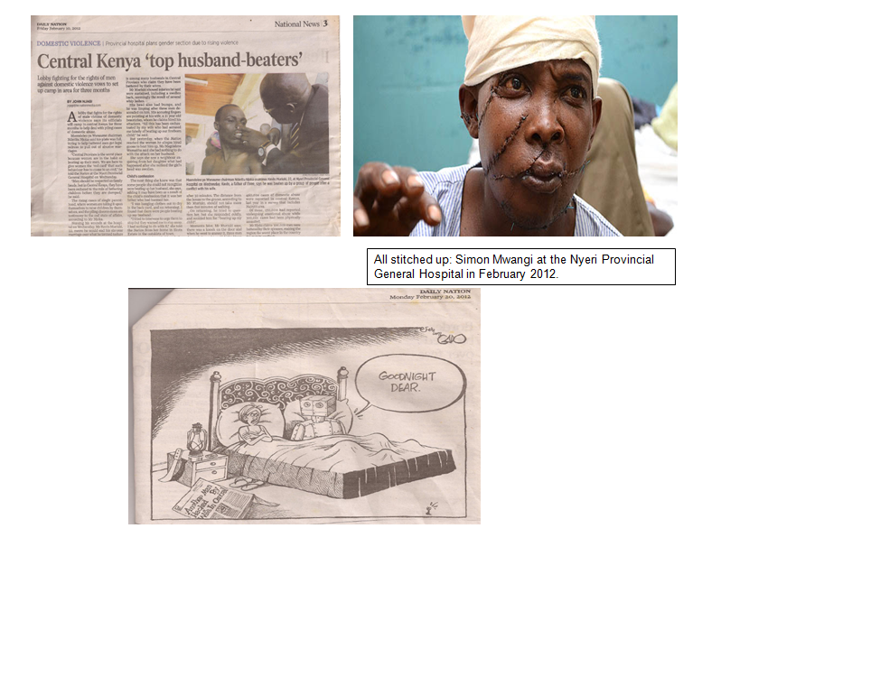
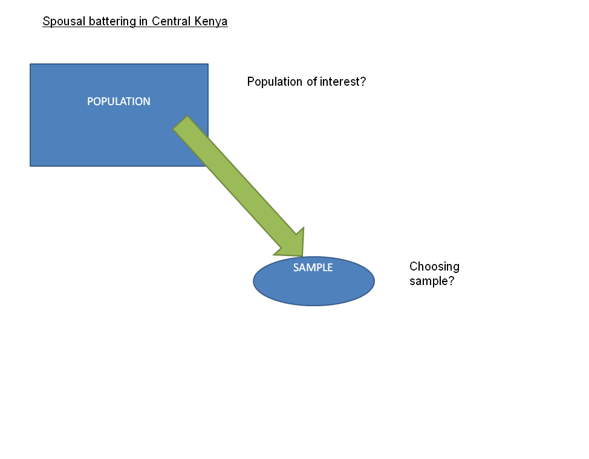
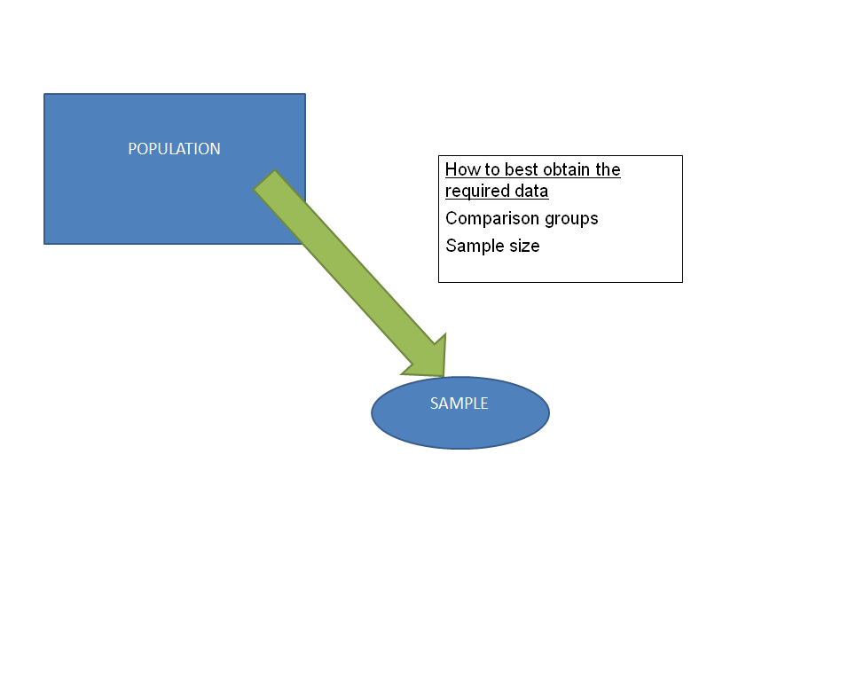
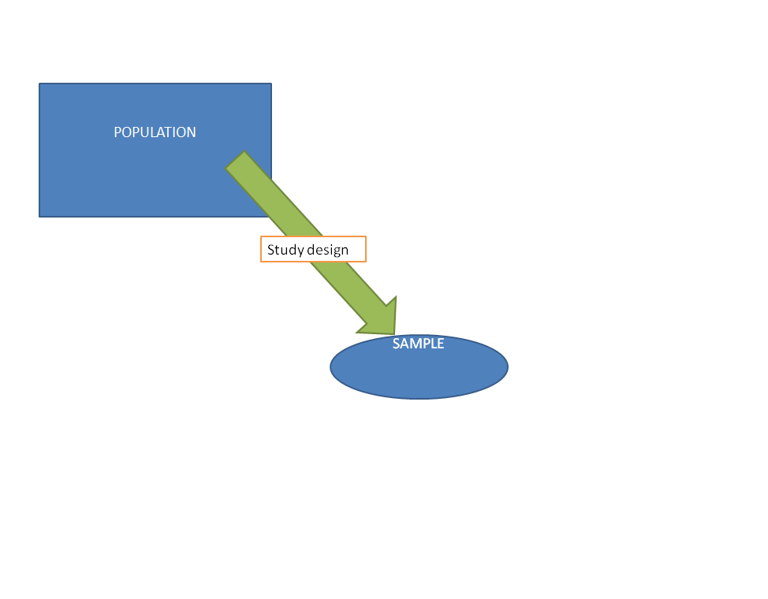
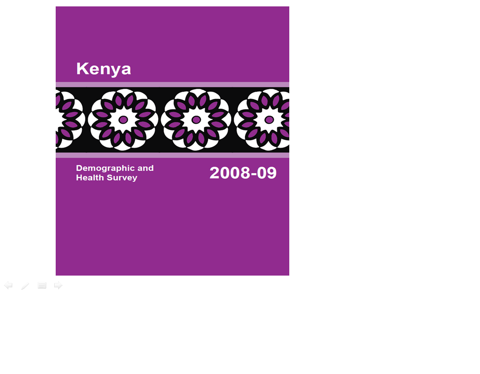
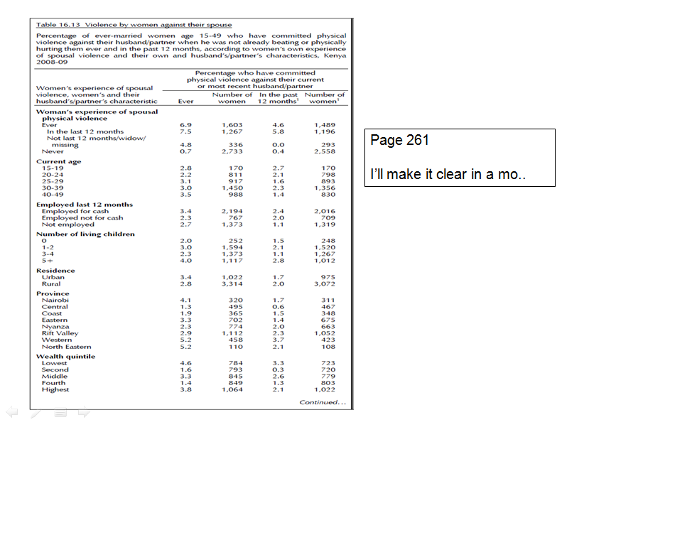
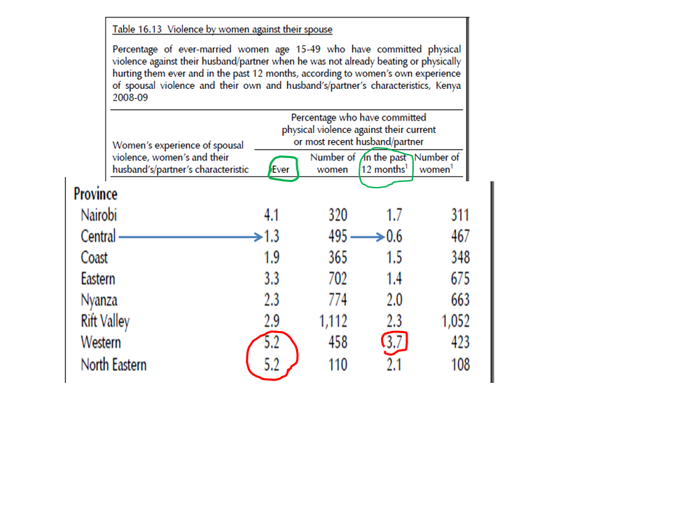
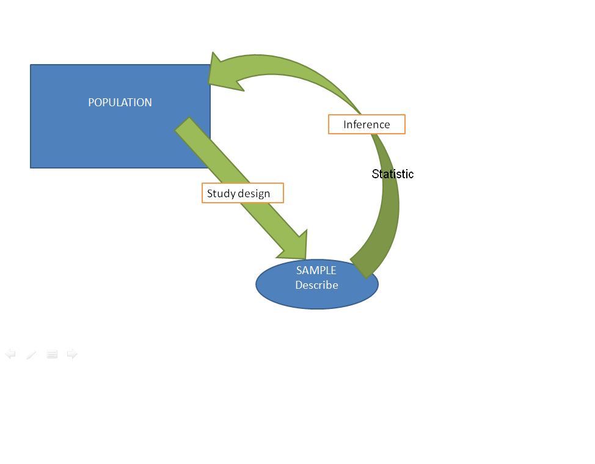

## Content 
- Definition of statistics and its components

- Populations and samples

- Exposures and outcomes 

- Variables

- Statistics

## What is statistics?

Statistics is the science of Collecting, Summarising, Presenting and Interpreting data

## Examples….a case study
- There is anecdotal evidence of a phenomena...

***

## Question 
- Are women from Central Province battering their husbands/partners more than women from other provinces in Kenya?

## Exposure & Outcomes
- The exposures and outcomes of interest are specific to study hypotheses

- Should always be clearly defined before the study starts

- Type of outcome determines the analysis that will be used. 

## Outcomes

- The outcome of a study is a broad term for any defined disease, state of health, health-related event or death. 

## Outcomes

- An outcome is the result of an experiment or other situation involving uncertainty.

- Its the focus of your attention – seeking to understand its occurrence and variation 

- In some studies, there may be multiple outcomes.

## In this case our outcomes is….

## In this case our outcomes is….
- Husband/partner batering

## Exposure
- The exposure of interest may be associated with either an increased or a decreased occurrence of disease or other specified health outcome,

- May relate to the environment, or inborn or inherited characteristics 

## Exposure in this case is?

## Exposure 
- Residence = Central province ??

- Ethnicity = Kikuyu??

Spousal battering in Central Kenya
--------------------------------------

Choosing your sample 
--------------------

- Population of interest?
    - Partnered/married women in Kenya

- Choosing sample

    - Partnered/married women from central + other provinces

    - Why would you not choose married/partnered men?

***

Decide on study design
----------------------

- Descriptive 
  - Cross sectional 

- Analytical 
  - Case-control
  - Cohort

- Experimental 

***

## Describe your sample
- Characteristic measured for each subject

- Values of the characteristic vary among subjects in a sample or a Population.

- These can be categorical or quantitative

## Categorical variables
- Unordered categorical variables
    - Marital status
        - married, divorced etc
    - Residence
        - rural or urban
    - none is higher than the other 
- Ordinal categorical variables
    - Wealth quantiles
          - High, medium, low
    - Employment
        - unemployed, casual laborer, etc
    

## quantitative variable 
- Takes numerical values, which differ in magnitude. Each value is greater than or lower than any other possible value

    - Discrete
          - Number of children: 0, 1, 2, 3, 4, …
    - Continous

          - Weight

***

## Statistics 
- Allow us to use the sample to make inferences about the population from which it was derived……

***

Lucky for us someone has attempted to answer this question

***

## remember our issue
- Are women from Central Province battering their husbands/partner more than women from other provinces in Kenya

- The purpose of a statistical analysis is to quantify the magnitude of the association between one of more exposure variables and the outcome variable 

## How?

- Nov 2008 to Feb 2009

- All 8 provinces

- 8,444 women 15-49 years old

- One-off questionnaire

## Questionnaire

- Have you ever hit, slapped, kicked or done anything else to physically hurt your (last)husband/partner at times when he was not already beating or physically hurting you?

- 6,318 Kenyan women 15-49 years old participated

***

***

***

## Conclusion

- Central province women are the least likely to batter their husbands than women from any other province.

## Conclusion

- Central province women are the least likely women to batter their husbands than women from any other province. 

- What is missing?

***

My take…….

## My take

- Have you ever hit, slapped, kicked or done anything else to physically hurt your (last)husband/partner at times when he was not already beating or physically hurting you?

## My take

- Test to compare proportions
      - which ones?

- If you have collected the wrong data – the best analysis will not help you....

***

## In conclusion
- MARRY A WOMAN FROM CENTRAL PROVINCE BUT DO NOT PROVOKE HER

- THANK YOU

