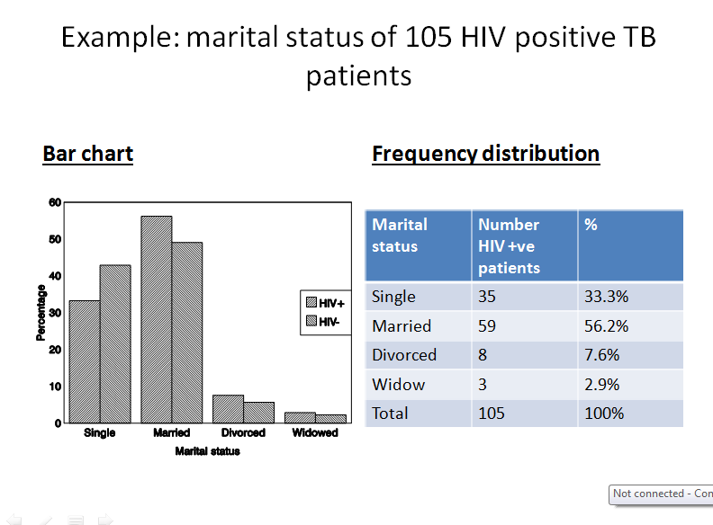

## Measures of data

- Measures of central value/tendency

- Measures of variance/dispersion 

## Measures of central tendency

- Concept that has to do with the centre of a distribution
    - Mode
    - Median
    - Mean 

## measures of central tendency

12, 0, 5, 13, 0,  0, 5,  10, 5, 1,  5, 6,  7, 5, 7,  8, 10, 5, 11,14

- arrange in order 

0,  0,  0,  1,  5,  5,  5,  5,  5,  5,  6 , 7,  7,  8,  10, 10, 11,  12, 13,14

- Mode is most frequently occuring number
    - mode rarely used

- Median is value that divides data in half

## measures of central tendency

12, 0, 5, 13, 0,  0, 5,  10, 5, 1,  5, 6,  7, 5, 7,  8, 10, 5, 11,14

- Mean
    - sum of all observations divided by number of observations
       $$\frac{\sum xi}{n}$$

## library books illustrations

- Students borrow and return books from a university library regularly

14, 13, 12, 11, 17, 20, 14, 16, 12, 12, 11, 9, 18, 21

- One student borrows a book and forgets to return it

- They re-discover the book 1 year later when moving out of the student accommodation and decide to return the book

14, 13, 12, 11, 17, 20, 14, 16, 12, 12, 11, 9, 18, 21, 365

- What do you think will  happen to the mean and median of a data set on borrowing periods?

## library books illustration

- The mean is the preferred measure of central tendency when describing a data that do not have outliers. 
- A major disadvantage is that it is affected by outliers (i.e. single observations which are very extreme compared with most observations and whose inclusion or exclusion changes results noticeably).
-In the presence of outliers, the median is the preferred measure of central tendency

## library books illustrations

- Calculation of the median does not involve the use of all available data and is therefore has less power than the mean.

***

- MEASURES OF DISPERSION

    - Dispersion = variation 

## Measures of dispersion 
- They give us an idea of the variation or spread of values around the central one. 

    - Variance and standard deviation   
    - Range
    - Interquartile range
    

## Variance

- Can be defined in terms of how close the scores are to the middle of the distribution(mean)
- This variability or variance can be measured in terms of how far observations are from the mean on average i.e. how far, on average, each observation deviates from the mean. 
- variance = by dividing the sum of squares of these deviations by (n‑1). 
- The formula for the variance is: $$\frac{\sum(xi - x)^2}{(n-1)}$$

***

## Standard deviation 
- Standard Deviation (SD): A measure of the average spread of values about the mean.
- It is usually more convenient to express the variation in terms of the original, unsquared units (e.g. grams), i.e. to take the square root of the variance. 
- This is then called the standard deviation (SD). 
- A small standard deviation indicates that most values lie very close to the mean 

## variance to standard deviation 

## Measures of dispersion: Range

- The interval between the largest and smallest

0,  0,  0,  1,  5,  5,  5,  5,  5,  5,  6 , 7,  7,  8,  10, 10, 11,  12, 13,14

- Range is 

- based on only two observations and gives no idea of how the observations are arranged between these two. 

## Measures of dispersion: Inter-Quartile Range

- Shows spread of the middle 50% of the distribution

0,  0,  0,  1,  5,  5,  5,  5,  5,  5,  6 , 7,  7,  8,  10, 10, 11,  12, 13,14
 
***

## graphically showing variability

- Box and whisker plots for median and Interquartile range
- Can compare several groups

## graphically showing variability
  - Histograms
  - Frequency polygons
  - Stem and leaf diagrams
  
## Categorical data
    - Marital status
    - Blood group
    - etc
    
-Calculating percentages enables one to make comparisons between different groups.

- The frequency distribution of a categorical variable can be presented in a table or graph
 

***

***

THANK YOU

