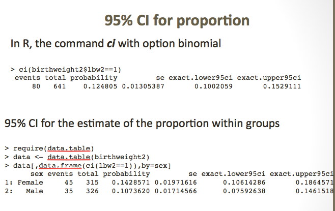
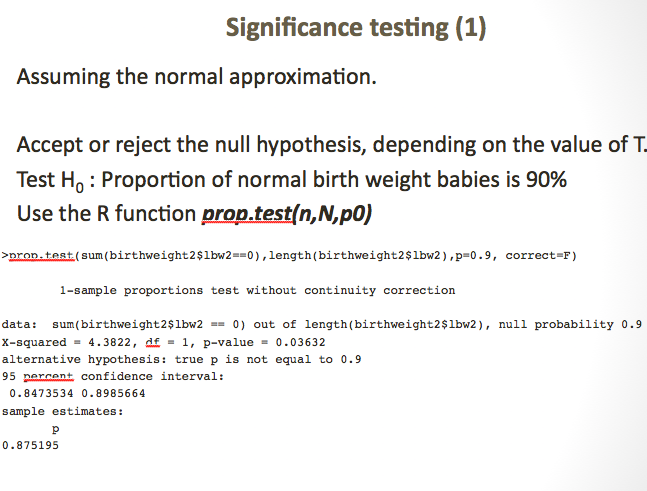
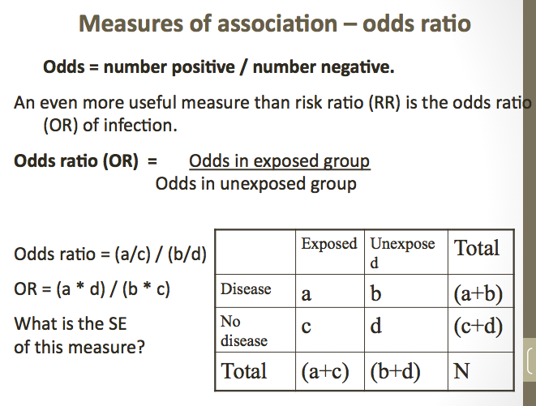
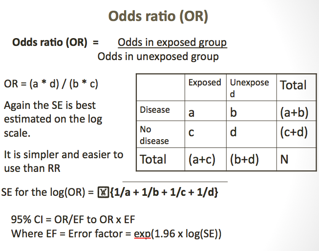
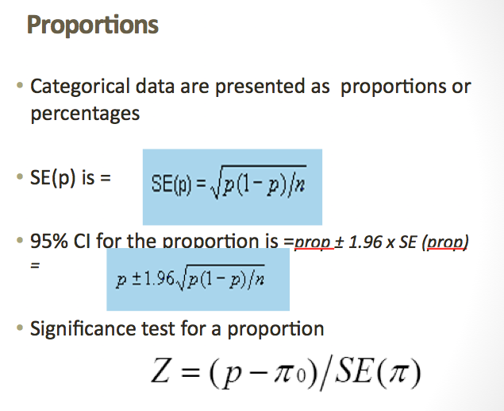
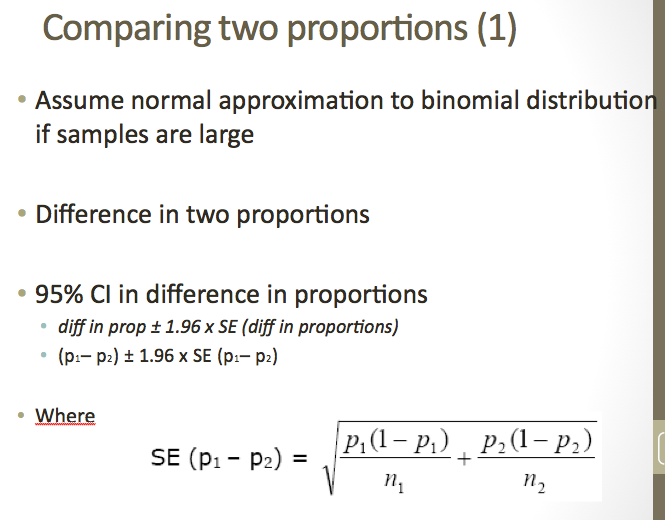
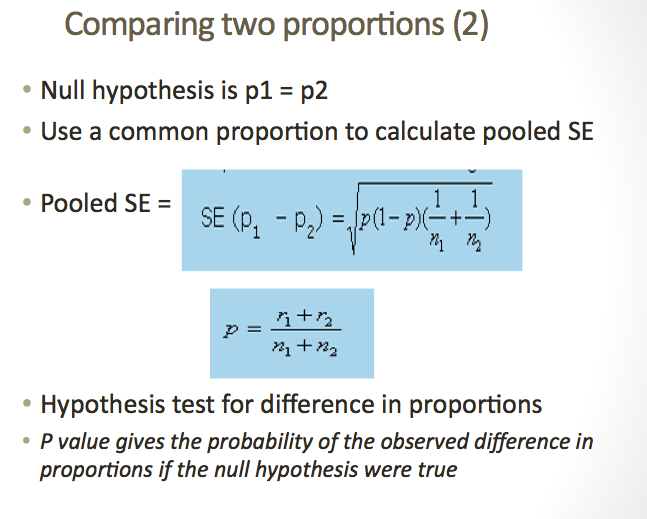
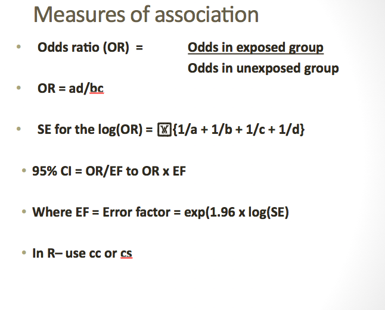

### Analysis of binary data

### Objectives
- Present binary data
- Calculate proportions & standard error of the proportion from sample data.
- Use standard error to calculate 95% CI and to test hypothesis on proportions.
- Use Chi-squared test. 
- Teach some theory, let you explore the concepts using R.


### Binomial distribution 

Binary data = Yes/No  or 0/1  or Pos/Neg
Calculate proportion as number positive/Total in sample

Population proportion  is  P
Sample proportion  is   p

Assumptions:
 - Our sample accurately reflects the population from which it is drawn
 - Our data is drawn from a binomial distribution.
 
 * * *
 
 If the distribution of the data is binomial, then we estimate the proportion, p.

Proportion  p  = Number positive
  	        Total number in sample
            
The standard error of the proportion (large sample, normal approx).

 Standard error of  $p = SE (p)   =  \frac{ (p) (1-p)}{ n }$
 
### Summary of SE

 - The population proportion is unknown, and fixed.  The standard error does not refer to the population proportion p.

 - Standard errors are calculated for estimated proportions (p) to show the uncertainty of the estimate.

 - The larger the sample size, the smaller the standard error of the estimated proportion.

 - Standard errors are used in 2 ways;
    - To calculate 95% confidence limits around our estimate
    - To test hypothesis about our estimate.

### 95% Confidence Interval for a Proportion--

From our sample we estimated:
  the proportion positive $p = \frac{(pos) }{(total in sample)}$
  And the standard error of $p= SE(p) =  \frac{ (p) (1-p)} {n}$
Using the normal approximation we can obtain 95% CI of our estimate : 
$p-1.96(SE) , p+ 1.96(SE)$


The meaning of the 95% CI is we are 95% sure the true proportion P lies is covered by this interval.


### 95% CI of the sample proportio

The 95% CI of the sample proportion will contain the (unknown) population proportion for 95% of possible samples taken from the population.

Larger sample size gives smaller 95%CI


### 95% CI for proportion



### Significance testing (1)



### Significance testing (2)

```{r}
birthweight2 <- read.csv("birthweight2.csv")
birthweight2$lbw2 <- as.numeric(birthweight2$lbw)
binom.test(sum(birthweight2$lbw2==0),length(birthweight2$lbw2),p=0.9)
```

### Summary:  Basic tools for the analysis of binary data:

Descriptive: Bar charts, and tabulation of the data

Analytic : Creating 95% CI and hypothesis testing.
1. Assuming approximation, use prop.test()
2. Exact methods based on binomial distribution. Use ci()   and binom.test() 

### Practical 5. Analysing Low birth weight

- Use birthweight2
- Check the variables, and explore the data.
- Look at the variable lbw, it is coded 0=LBW, 1=Normal
- Generate a new variable showing 1=LBW and 0=Normal
- Get the proportion of low birth weight babies and 95% CI.
- Get the proportion of lbw babies (and 95% CI)  by sex.
- Test the hypothesis that p=0.90 (90% normal BW)
- Test this hypothesis for male babies and female babies separately

### Comparing proportions

Objectives:

To estimate differences in proportions, and get 95% CI for the difference. \newline
To test the hypothesis that the proportions are different, there are several ways to do this:
  - Using a normal approximation (Z-test)
	- Using chi-squared test (session 3)
	- Using exact methods (session 3)
  
Show how to do this in R, with useful options to explore binary data.

### Difference in proportions

Difference between two proportions is:   p1 - p2

Standard error of $(p1 - p2)$ for the 95% CI

$$
SE = \sqrt{\frac{(p_1(1 - p_1)}{n_1} + \frac{p_2(1 - p_2)}{n_2)}}
$$
                
Then calculate the 95% CI using the standard method:

               $$(p1 - p2) \pm 1.96 * SE(p1 – p2)$$

### Hypothesis testing

Null hypothesis $H_{0}$ : Both proportions the same  = **overall p** 

Calculate overall proportion
$$
p  =  \frac{(r1) + (r2)}{(n1+ n2) }
$$
	
The common proportion will always be between the two proportions

Standard error of $\bar{p}$ to test the null hypothesis.

$$
SE(\bar{p})  = \sqrt{\bar{p}.(1 - \bar{p}).(\frac{1}{n1}+ \frac{1}{n2})}  = the pooled SE
$$

### Relationship between significance and 95% CI

95% CI includes zero    ---    $H_0$ not rejected at 5% level

95% CI does not include zero   ---	$H_0$ rejected at 5% level 

Null hypothesis:  H0: p1 = p2    	or $H_0: p1 - p2 =0$

The calculation of the standard error of the difference in proportions for the hypothesis test IS DIFFERENT FROM  the calculation of the standard error of the difference $(p1 - p2)$ for the 95% CI.

This is because the hypothesis test assumes there is no difference (the NULL hypothesis), whereas the 95% CI assumes there is a difference (and we want to quantify the uncertainty around the difference).

### Session 3: Chi- squared test - Comparing proportions - chi-squared test

Comparing two (or more) proportions 

  – the Chi-squared test uses Expected numbers.

Chi-squared test is valid for any contingency table

Assumptions: sufficient numbers in each cell of the table

1. State the null hypothesis: No association between the two variables.
2. Calculate the expected numbers for each cell.
3. Calculate the Chi-squared statistic from the Observed and Expected numbers
4. Test against the chi-squared distribution.
5. Obtain the p-value for the data, under $H_0$ 

### Chi-squared test – the calculations

$$
Expected number in each cell =\frac{ row total X column total}{overall total}
$$

Equivalent to the same percentage in each group. 
Chi-squared statistic:

$$
\sum(observed-expected)2/expected),	X_{2}= \sum(O - E )2/E
$$

Note the calculation is done for each cell, and then summed up over all cells.


*** 

```{r}
mytable <- table(birthweight2$sex,birthweight2$lbw2)
mytable
summary(mytable)
```

*** 
```{r}
chisq.test(birthweight2$sex,birthweight2$lbw2,correct = FALSE)

```

### Contingency tables – the exact test

If Chi-squared test not valid then get R to test the null hypothesis H0 using  the Fishers exact test.

```{r}
fisher.test(birthweight2$sex,birthweight2$lbw2)

```

### Chi-squared test - for larger tables

Chi-squared test can be used for larger tables, with more categories (eg. agegroups).  Same assumptions about expected number

 - Tabulate outcome by explanatory factor
 - Calculate expected numbers for each cell
 - Calculate the test statistic:
 
$$     
X_{2}= \sum(O - E)2/E
$$
 
 - Calculate the degrees of freedom (d.f.)
	**d.f. = (number rows – 1) * (number of cols -1)**  
  
 - Test against the Chi squared distribution, and get the p-value under the null hypothesis $$(H_0) $$

### Chi-squared test - for larger tables

Larger tables using R

```{r}
mytable3 <- table(birthweight2$ethnic,birthweight2$lbw2)
mytable3
summary(mytable3)
```

### Larger tables -many levels of an exposure

For an ordered categorical exposure variable, it is possible to analyse for a trend across exposure levels. Two methods of doing this:

- Chi-squared test for trend.
- Test for trend in odds across the levels. 

```{r}
t<- table(birthweight2$lbw2 ,birthweight2$gestwks)
t
x<-t[2,] # number of low birth weights
n<-apply(t,2,FUN=sum)   # total number of births in each gestation age group
prop.trend.test(x,n)     # Trend test; Significant 

```

### Summary of the comparison of proportions 

Using the normal approximation (use Z-test):
  - SE(diff) for calculating the 95% CI
	- SE(p) to test H0
Using Chi-squared to test the null hypothesis.  Needs sufficient numbers for each cell (chisq.test() , summary(table())) 
If not then use exact methods to test difference – Fishers exact test (fisher.test())

### Practical 6. Analysing Low birth weight

- Use birthweight2, with outcome low birth weight (lbw) 
- Ensure you have the variable that shows 1= LBW, 0=Normal
- Tabulate and test if lbw differs by sex of baby.  What is the difference in proportion lbw between the sexes.
- Tabulate the low birth weight by hypertension status of mothers (variable is called ht)
- Look at the association between lbw and hypertension (ht), using the chi-squared test
- Compare the proportion with low birth weight by the ethnic groups.  What problem do you see?

### Measures of association

Measures of association

Objectives:

1. To define risk ratios, odds ratios and other measures of association
2. How to get standard errors for risk ratios and odds ratios, and to use these to obtain 95% CI for these measures.
3. How to obtain these measures in R
4. When the different measures are used.

### Measures of association- Prevalence ratio---

$$
Prevalence (risk) = \frac{Number positive}{Total number}
$$

$$
Prevalence ratio (risk ratio)  = \frac{Prevalence in exposed group}{Prevalence in unexposed group}
$$

What is the standard error of Risk ratio (RR) ?

------------------------
### Risk ratio (RR)


### Measures of association – odds ratio



### Odds ratio (OR)



### Odds ratio & risk ratios in R


### Odds ratio & risk ratios in R


### Odds ratios and Risk ratios 

Standard errors can be obtained on the log scale, and used to obtain 95% CI and to test hypothesis

Several commands in R to obtain odds ratios, and risk ratios.

For cc, and cs functions, make sure you have the coding right.


### Practical 7

- Use the same dataset birthweight2.dta
- Check the Odds ratio for the association between LBW and hypertension
- Look at the association between LBW and gestational age.  Divide gestwks into  quartiles and analyse as groups, check for trend
- Look at birth weight and maternal age (in groups).
- Finally look at a different outcome, hypertension and age.

### Summary

### Proportions



### comparing two proportions (1)



### comparing two proportions (2)



### Chi-square

1. State the null hypothesis.

2. Calculate the expected numbers if H0 were true.

3. Calculate a test statistic that measures how far the observed numbers are from the expected.

4. Compare this test statistic with its theoretical distribution. Calculate the probability that this result (or one more extreme) could have occurred by chance.

5. Interpret the result: assess the strength of the evidence against the null hypothesis.

### Measures of association---

