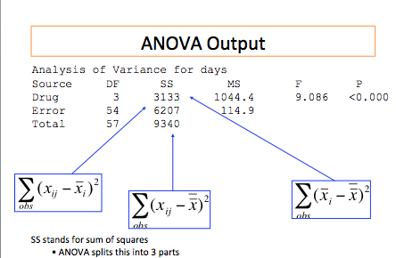
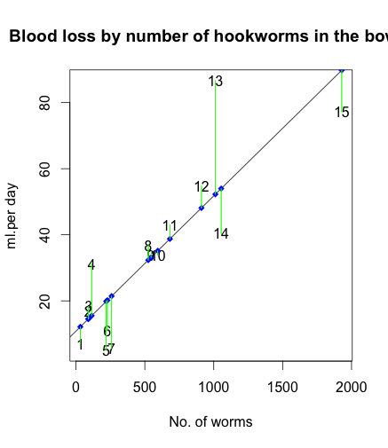
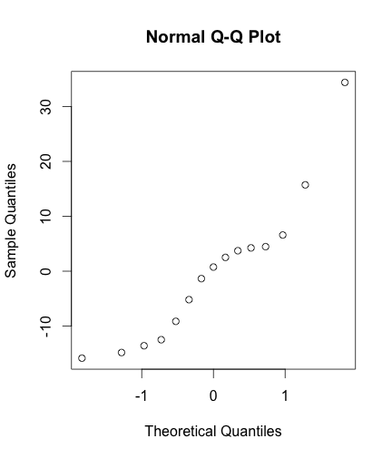
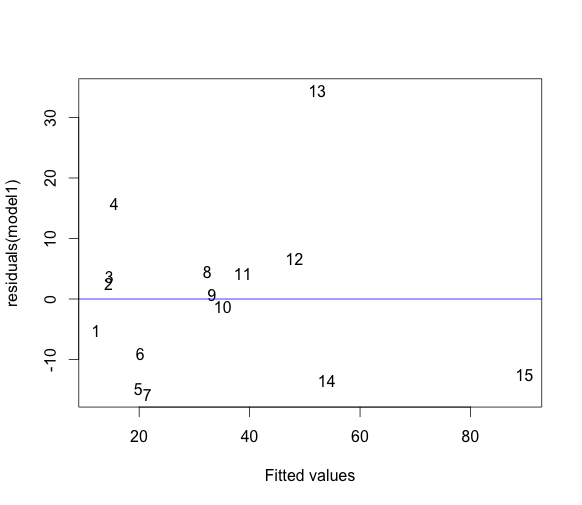

## ANOVA 

**Comparison of means form several groups: The basic ANOVA situation**

When the exposure variable has more than two categories, we often wish to compare the mean outcomes from each of the groups defined by these categories. 

Example, - Wish to examine how the systolic blood pressure measurements collected as part of the routine hospital visits vary with age groups (3 categories) or sex or ethnic groups or socioeconomic classes.

## ANOVA
Main Question: Do the means of the quantitative variables depend on which group the individual is in?

If categorical variable has only 2 values: 
 2-sample t-test 

ANOVA allows for 3 or more groups


## ANOVA
**Exploratory Data analysis** \newline
Graphical investigation: 

 1. Side-by-side box plots
 2. Multiple histograms

***
**What ANOVA does** 

$H_0$: The means of all the groups are equal.

$H_a$: Not all the means are equal

Doesn’t say how or which ones differ. Follow up with “multiple comparisons”

Whether the differences between the groups are significant depends on;- 

 a) The difference in the means
 b) The standard deviations of each group
 c) The sample sizes
 
****
**Assumptions of ANOVA**\newline
Each group is approximately normal 

 - Check this by looking at histograms and/or normal quantile plots, or use assumptions

 - Standard deviations of each group are approximately equal

## ANOVA
 **Description of the data ** \newline
 A sample of individual diagnosed with a particular disease and categorized as either
 1 –” low diseased” 2 – “middle level diseased” and 3 – “highly diseased”.
 4 drugs known to Control the systolic blood pressure were administered to the sampled individuals and their  Systolic blood pressure recorded after 24 hours. 


***Question of interest*** 

1. Compare the means of  systolic blood pressure by the drug administered, is there a significant difference in the drugs administered – One way ANOVA

2. Compare the means of the systolic blood pressure by the drug administered given the disease status of the individuals. – Two way ANOVA

***
```{r , echo=F, message=FALSE}
library(epicalc)
library(foreign)
library(Hmisc)
library(ggplot2)
```


```{r}
data<-read.csv("data/systolic.csv", header=T)
data$drug<-as.factor(data$drug) #
data$disease<-as.factor(data$disease) #
```

***

```{r}
summ(data$systolic, by=data$drug ,graph = F)   
```
***
```{r}
ggplot(data, aes( drug, systolic )) + geom_boxplot() + theme_bw()
```

***
***How ANOVA works***

ANOVA measures two sources of variation in the data and compares their relative sizes

 a) Variation BETWEEN groups
 for each data value look at the difference between its group mean and the overall mean
$$
(\bar{x_{i}} - \bar{x})^2
$$

 b) Variation  WITHIN groups 
 for each data value we look at the difference between that value and the mean of its group
$$
({x_{ij}} - \bar{x_{i}})^2
$$

***
The ANOVA F-statistic is a ratio of the Between Group Variaton divided by the Within Group Variation:      
$$
F=\frac{Between}{Within}=\frac{MSG}{MSE}
$$

A large F is evidence against $H_0$, since it indicates that there is more difference between groups than within groups

To get the P-value, we compare to $F(k-1,n-k)$
-distribution $k-1$ degrees of freedom in numerator (# groups -1) $n-k$ degrees of freedom in denominator 


 
## 

```{r}
one.way<-aov(data$systolic~data$drug)                 
```



***
**Normality and Variance Homogeneity test**

Test of homogeneity of variances
```{r}
bartlett.test(data$systolic,data$drug)               
```
Normality test
```{r}
shapiro.test(resid(one.way))              
```

***
### LINEAR REGRESSION
**Linear Regression with One Predictor variable**

Regression analysis is a statistical methodology that utilizes the relation between two or more quantitative variables so that a response or outcome variable can be predicted from the other, or others. 


Examples of regression method;-

1. The length of hospital stay of a surgical patient can be predicted by utilizing the relationship between the time in the hospital and the severity of the operation.

2. Sales of a product can be predicted by utilizing relationship between sales and amount of advertising expenditures.

***
Linear regression involves modelling a continous outcome variable with one or more explanatory variables. 

With all data analysis the first step is always to explore the data. In this case, scatter plots are very useful in determining whether or not the relationships between the variables are linear.

***

**Assumptions of Linear Regression**

1. Variables are normally distributed

2. Variables are related linearly

3. Errors are identically and independently distributed (normally) with mean zero and equal variance

4. Covariance between predictors and error terms is zero

5. No correlation between the predictors

***
**Data Description**

Dataset (Bloodloss.csv) to be used for this section concerns the relationship between Hookworm infection and blood loss from a study conducted in Kibera in 2004.

The dataset has 3 variables (id, worm,bloodloss) and 15 records.

The objective of this analysis is to examine the relationship between these variables

***

**Graphical representation - Scatter plots**
```{r}
Bloodloss<-read.csv("data/Bloodloss.csv", header=T)
plot(Bloodloss$worm, Bloodloss$bloodloss)

```

***
**Fitting a linear Regression **
```{r}
model1<-lm(Bloodloss$bloodloss ~ Bloodloss$worm)

```
***
```{r}
summary (model1)
```
***
The first section shows the formula that was "called". The second section gives the distribution of residuals. The third section gives coefficients of the intercept and the effect of 'worm'on blood loss. 

***
**Interpreting the coeeficients**

The intercept is 10.8 meaning that when there are no worms, the blood loss is estimated to be 10.8 ml per day. However, it's not significantly different from zero as the P value is 0.0618. 

The coefficient of 'worm' is 0.04 indicating that each worm will cause an average of 0.04 ml of blood loss per day, which is highly significant from zero.The multiple R-squared value of 0.716 indicates that 71.6% of the variation in the data is explained by the model.

***
From the analysis, it is clear that blood loss is associated with number of hookworms. On average, each worm may cause 0.04 ml of blood loss. The remaining uncertainity of blood loss, apart from hookworm, is explained by random variation or other factors that were not measured.


***
Fitted and observed points


***
**Diagnostics checks**
      
Checking for normality of residuals
If you plot the histogram of the residuals it will be difficult to conclude normality due to the small sample size.

Better to plot the residuals against the expected normal score or 
to use the Shapiro-Wilk test 
```{r}
shapiro.test(residuals(model1))

```
***


***
**Checking on independence**
There is no obvious pattern. The residuals are quite independent of the expected values



