##Simple or general linear model?
- Here **general** refers to the dependence on potentially more than one explanatory variable (i.e. multiple linear regression), v.s. the **simple linear model**: 

##Simple or general linear model?
- The model is linear in the parameters, e.g. 

$$
y_i =\beta_0 + \beta_1x_1+ \beta_2x{_1}{^2}+\epsilon_i
$$

- But not e.g.

$$
y_i =\beta_0 + \beta_1 x_{1}^{\beta_{2}} +\epsilon_i
$$

## General or generalized linear model?

\begin{multicols}{2}
 \includegraphics[scale=.5]{gm1.png}
\begin{itemize}
\scriptsize
  \item There are situations where, general linear models are inappropriate:
  \item The range of Y is restricted (e.g. binary, count)
  \item The variance of Y depends on the mean 
  \item Generalized linear models extend the general linear model to address these issues
\end{itemize}
\end{multicols}

## General or generalized linear model?
- A generalized linear model is made up of a linear predictor = relates mean to predictors
- and two functions:
- a link function (transform done on Y) = relates means of observations to predictors

- a variance function (the distribution) = relates the means to the variances

##  Poisson Regression or Regression of Counts (& Rates)

## Poisson Regression 
 - is a generalized linear model:

$$
linear predictor = \eta 
$$

$$
link function (transformation) = log transform
$$

$$
variance function (the distribution) = V (\mu) = \mu
$$

## Poisson Regression 

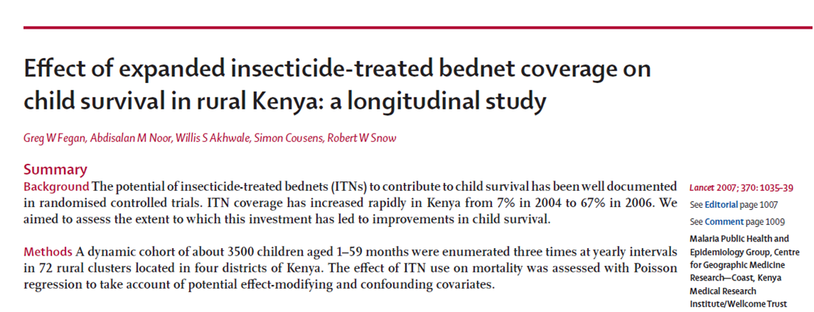

## Poisson Regression 
 - is a generalized linear model:

$$
linear predictor = \eta 
$$

$$
link function (transformation) = log transform
$$

$$
variance function (the distribution) = V (\mu) = \mu
$$

## Poisson Regression 

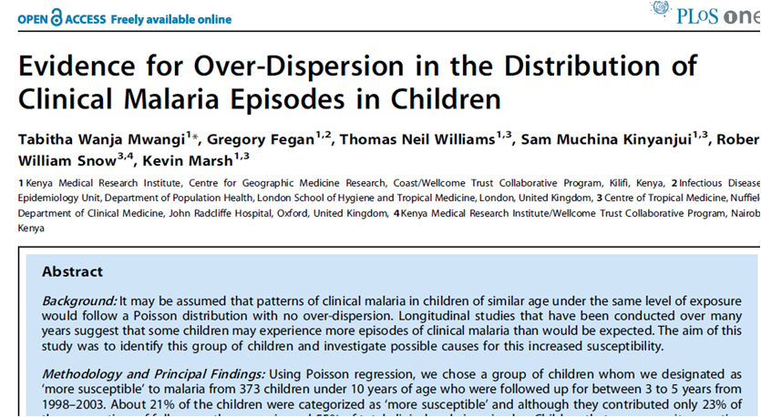

## Poisson Regression 

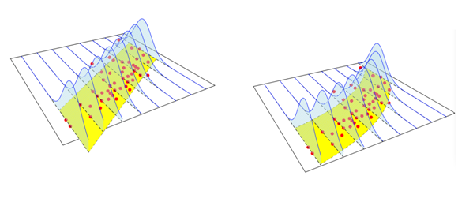

 - *L*inearity
 - *I*ndependence
 - *N*ormality
 - *E*qual variance

## Link function – Poisson regression
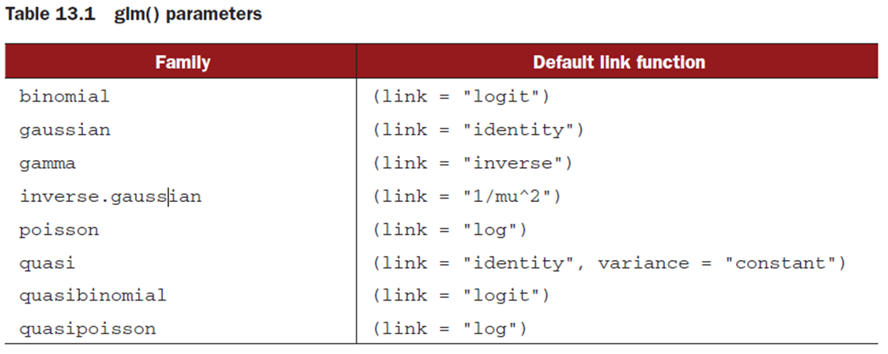

\begin{multline}
poisson.model = glm(Y\sim x_1+x_2+…+x_n,data=dataframe, \\
family=poisson(link="log")) 
\end{multline}

## Poisson distribution (discrete probability distribution)

## Poisson regression (Mwangi et al)

 - What is the difference in malaria episodes in children < 5 yrs. and all children (including > 5 yrs.) in Kilifi?
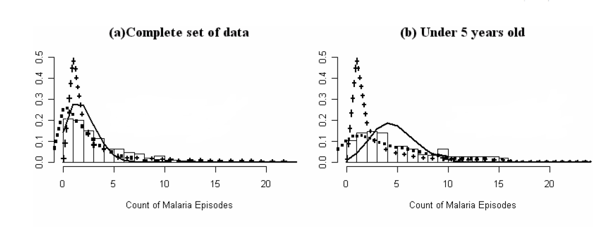

## Outcome in regression models

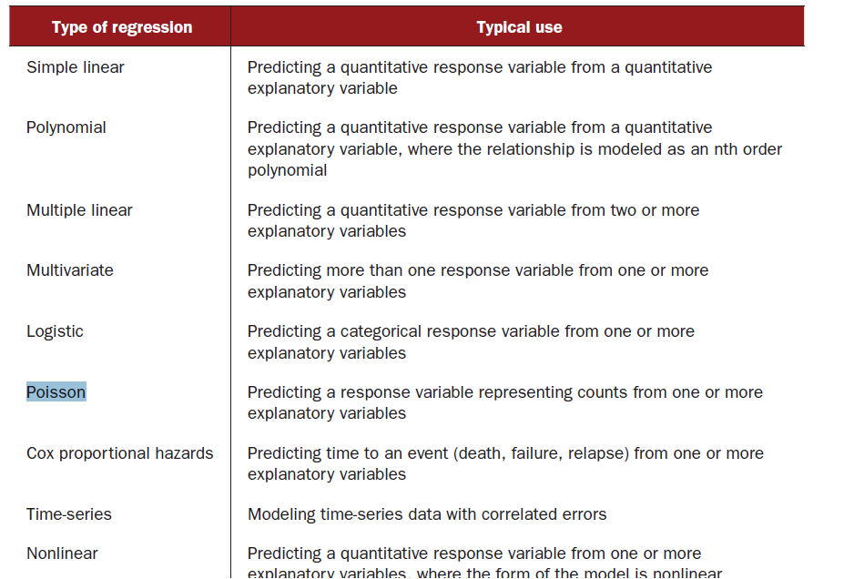

## R syntax

\begin{multline}
poisson.model = glm(Y\sim x_1+x_2+…+x_n,data=dataframe, \\
family=poisson(link="log")) 
\end{multline}

## Hypothesis testing in Poisson regression

## Count

## Rates

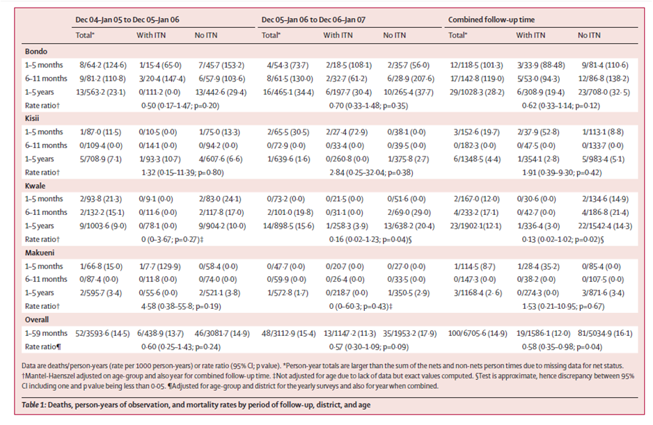

## Hypothesis testing and test for linear trend in Poisson regression
 - **Recap of time-to-event (TTE) data**
 
## Flow chart for regression models
 
 
 
## Recap time-to-event data

 

## Time to event (TTE)

 - Event: Pneumococcal acquisition among infants
  - Time-to-event also available

 - Statistical Modeling Approaches
  - **Logistic Regression:**  
     - Would do separate rate comparisons at distinct time points \% with Pneumococcal acquisition by 60days, by 90  days
  - **Cox Proportional Hazards Regression:** 
 	 - Comparison of survival curves across all time points
	     -  Uses more information: Event (Yes/No), TTE
	     - More powerful in identifying systematic differences 

## Time to first episode of malaria

 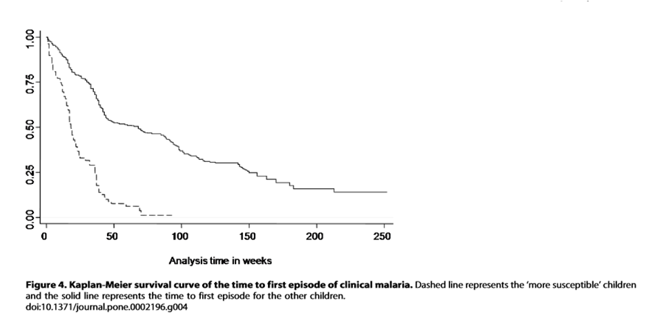
 
 
## Censoring
- Generally, three reasons why censoring might occur:
    - A subject does not experience the event before the study ends
    - A person is lost to follow-up during the study period
    - A person withdraws from the study
These are all examples of right-censoring   

##  Censoring 
- Most typical to consider start of time-to-event "clock" as t=0 
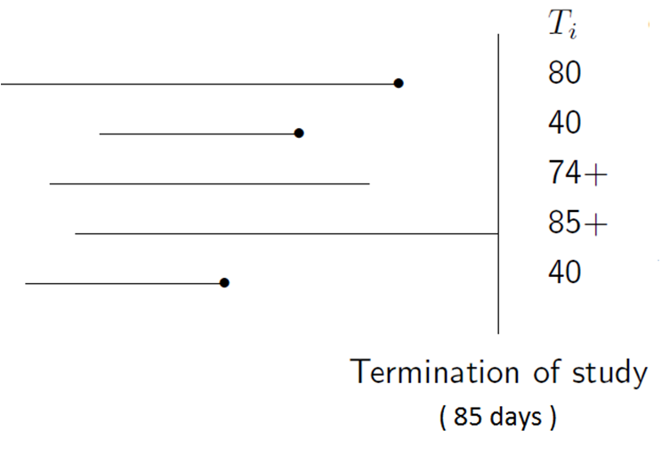

## Classical analysis of rates

## Life tables

## Life tables

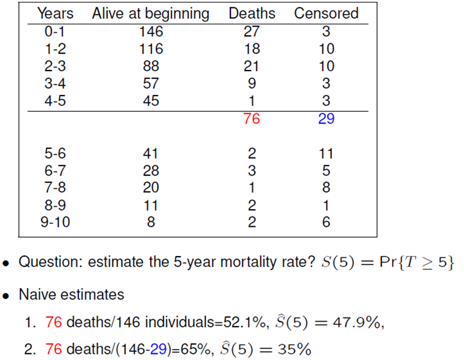

## Life tables

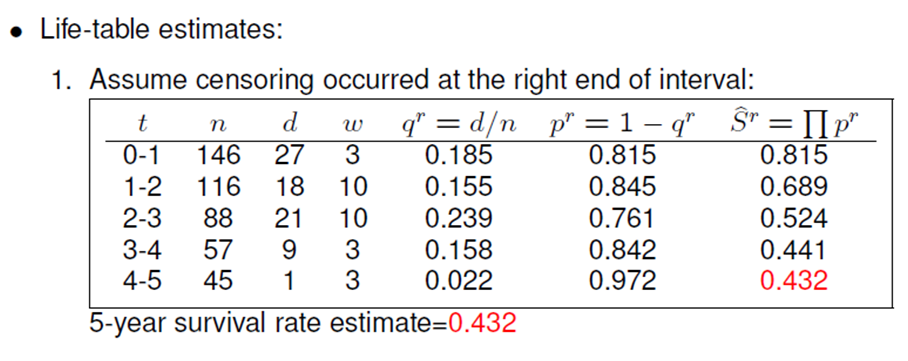

- Censored observations are counted in the denominator of those   
    "at risk" until they are censored

##Life tables

 - Censored observations are counted in the denominator of those   
    "at risk" until they are censored
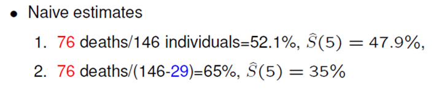

##Survival curve
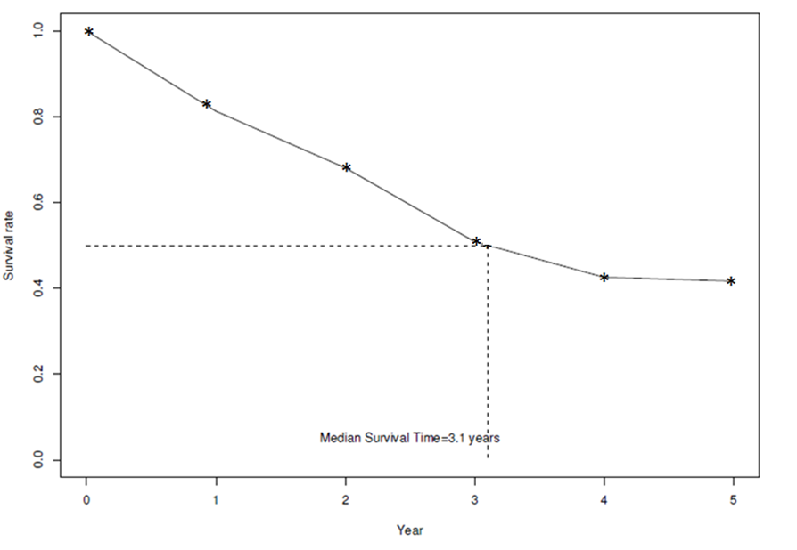

##Functions of interest in R
- Survival object: *Surv*
- Kaplan-Meier estimates: *survfit*
- The log-rank test: *survdiff*
- The Cox proportional hazards model: *coxph*
- The Accelerated failure time model: *survreg*
- Relevant R packages: *survival, survcomp, HMISC, Design, MASS*

##Practical analysis of events over time
