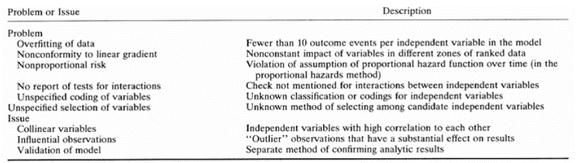
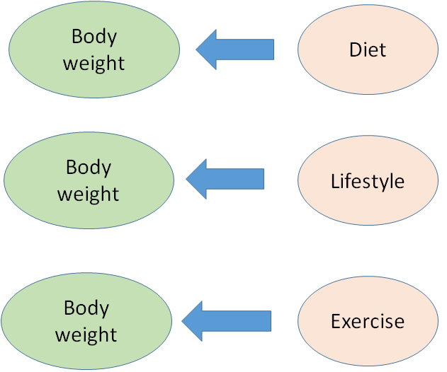
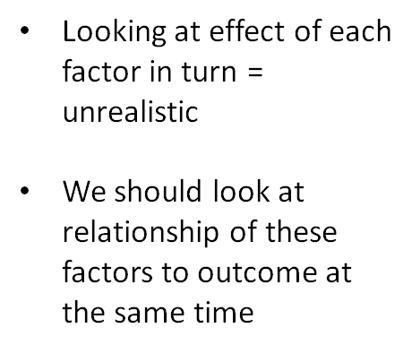
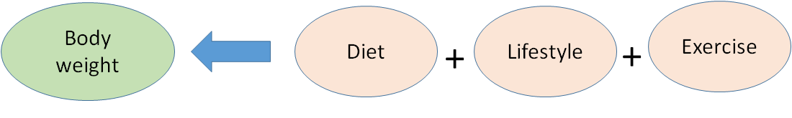
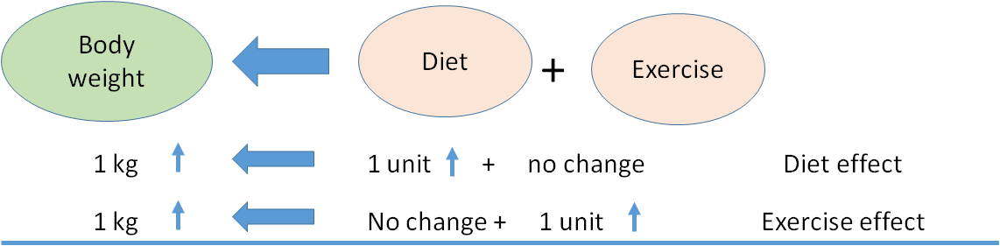
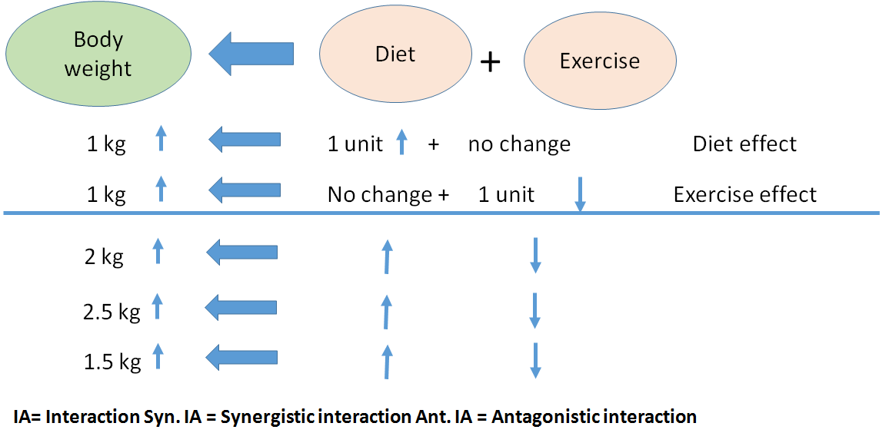
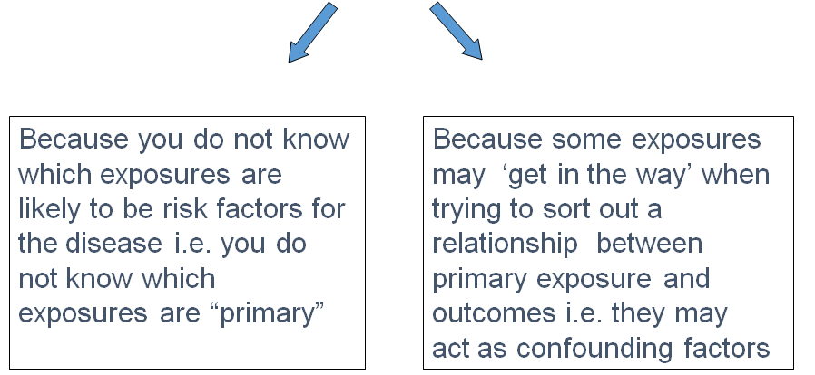
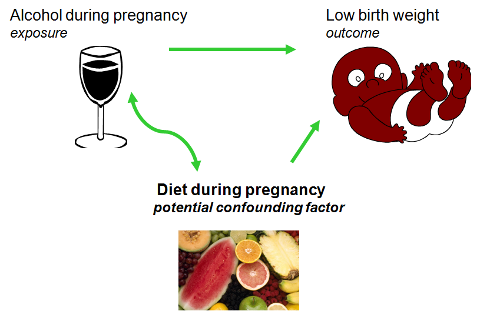

## Principles of multivariable regression analysis
- MVA relate 2 or more independent variables to an outcome (through mathematical expression)

$$
Cholesterol \Longleftarrow age + exercise + diet
$$

$$
y_i = \beta_0 + \beta_1 x_i + \beta_2 x_i + \beta_3 x_i +  \epsilon_i
$$

## Main multivariable models in biostatistics

- Generalized linear models
- A generalized linear model is made up of a linear predictor = relates mean to predictors
- and two functions:
- a link function (transform done on Y) = relates means of observations to predictors
$$
Cholesterol \Longleftarrow age + exercise + diet
$$
- a variance function (the distribution) = relates the means to the variances

## Main multivariable models in biostatistics
| Type of MVA regression         | Typical Use                                                                                                                                     |
|--------------------------------|-------------------------------------------------------------------------------------------------------------------------------------------------|
| Multiple (general) linear      | Predicting a quantitative response variable from 2 or more explanatory variables                                                                |
| Logistic                       | Predicting a categorical response variable from 2 or more explanatory variables                                                                 |
| Poisson                        | Predicting a response variable representing counts from 2 or more explanatory variables                                                         |
| Cox proportional hazards       | Predicting time to event (death, failure, relapse) from 2 or more explanatory variables                                                         |
| Time series                    | Modelling time series data with correlated errors                                                                                               |
| Discriminant function analysis | Predicting a group to which subjects belong (commonly use a score to classify obs into one of the categorical groups) -,c.f Logistic regression |


## "Multivariate" or "Multivariable" analysis? 
- Often used interchangeably, but:
- Multivariable - single outcome
- Multivariable - multiple outcomes e.g. factor analysis

##Purposes of Multivariable Analysis
- Bivariate confirmation
- Multivariable Confirmation
- Screening
- Creating Risk Scores
- Quantifying Risk of Individual Variables

## Common problems with MVA 

- Over-fitting or under-fitting
- Nonconformity to a Linear Gradient
- Violation of proportional hazards assumption
- No report of tests for interaction
- Unspecified coding of variables
- Unspecified selection of variables
- Collinearity of variables
- Influential observations
- Model validation

## Over-fitting or under-fitting

$$
Death \Longleftarrow smoking
$$

$\circ Non-smoker    \bullet smoker$

## Over-fitting or under-fitting


## Implications

|                                                                         | Impact                                                                                            |
|-------------------------------------------------------------------------|---------------------------------------------------------------------------------------------------|
| Overfiting                                                              | Unreliable risk estimates/ low precision                                                          |
|                                                                         | Spurious associations                                                                             |
| Under-fitting (variable  omission/ underpowered analysis)               | Predicting a response variable representing counts from 2 or more explanatory variables           |
|                                                                         | Misleading results                                                                                |

## Violation of PH assumption (Cox regression)
- Hazard ratio - does not depend on time (on covariates only)

- Methods for verification
- Plot of `cumulative baseline hazard estimates on a log-scale': Curves on the plot should be parallel with distance that is constant over time
- Survival curves: if PH assumption is met survival curve of one group will not cross the survival curve of other group   

## PH assumption


## Checking PH assumption in `R'

## No report of tests for interaction

- To be covered in the next session

## Unspecified coding
- readers should always be notified of how the coding was used in a multivariable analysis:
- Marginal (binary variable -1/+1) v.s. partial (binary variable 0/1) methods
- Ordinal variable coding = could use "dummy" variable or integer values
- Regression coefficients reported without concomitant citation of unit of coding e.g. single coefficient for age - could  mean continuous variable or a dichotomous variable (<5/ above 5 years)

## Unspecified Selection of Variables

- Strategies of variable selection for MVA
    - Previous research
    - Clinical experience
    - Automated algorithms - esp. prognostic studies

- Final model depends on the chosen selectin process

## Summary




## Principle MV models in `R'
- multivariable_reg_practical.pdf

##Introduction  Interaction &   Effect Modification

Introduction  Interaction &   Effect Modification

##Interaction/ effect modification

- Most of the outcomes (events) are determined (influenced) by more than one factor (e.g. body weight.)


##Interaction/ effect modification



## Interaction/ effect modification



- When we look at the relation of these factors (explanatory variables) to the outcome at the same time, ....
    - We will obtain the "independent effect" of explanatory variables to outcome.
    - We can also study the "interaction" (IA) between independent variables (Synergistic/Antagonistic IA)
    
## Interaction


## Interaction


## Detection/interpretation of interaction & effect modification 

- An interaction occurs when the product of two predictor variables is also a significant predictor (i.e. in addition to the predictor variables themselves)
- Create an interaction term
- Perform likelihood ratio test (LRT)

##Testing for interaction in `R'

- interaction practical.pdf

##  Confounding  and stratification 

Confounding  and stratification 

## Exposures and outcomes
In an epidemiological study there is:
 a. the outcome of interest
 b. the primary exposure (or risk factor) of interest
 c. other exposures that may influence  the outcome (potential confounders) 

## Exposures and outcomes
 - You will need to measure more than one exposure



## Question: Is alcohol consumption during pregnancy associated with increased risk of low birthweight ?



## Confounding is about 
** ALTERNATIVE EXPLANATIONS FOR AN EFFECT SEEN **
 - when an association between the Exposure under investigation and Outcome is "mixed up" with the effect of another exposure or exposures
 - when the effects of the two exposures have not been considered separately
   $OR = 1.40$ reflects true association.
   
## Confounding: Definition: for a factor to be regarded as a confounder the rules are:


1. The factor must be associated with the exposure being investigated
2. The factor must be independently associated with the disease being  investigated.
3. The confounder is not on the causal pathway.


## How to deal with confounding
 - Need to display the data separately for each level of the confounding factor 
 - Then examine the measures of effect within eachlevel (or strata)
 - If they different from the "crude" measure of effect,  but similar to each other, this is evidence of confounding
  *BUT no test for confounding.*

## Example: Case-control study of coffee comsumption and cancer of the pancreas


***

- We have shown that the "stratified" measure of effect (in this case odds ratios) are  different from the "crude" measure of effect, but similar to each other 
- Thus we have evidence that  Smoking  was acting as a confounding factor

**Question:  What is the odds ratio for the effect of Smoking on the risk of cancer of the pancreas?**

Use data from table below: 

|         | Non Smoker |          | Smoker |           |
|---------|------------|----------|--------|-----------|
|         | Coffee     | No Cofee | Coffee | No coffee |
| cases   | 50         | 100      | 400    | 200       |
| control | 100        | 200      | 100    | 50        |
|         |            |          |        |           |

***

$Answer= (600 * 300 ) / (150* 150) = 8$

***


***
- we investigate the control data further, we can see that the confounding factor is associated with the exposure under investigation:

|            | Coffee    | No Coffee |
|------------|-----------|-----------|
| Smoker     | 100 (50%) | 50(20%)   |
| Non Smoker | 100       | 200       |
|------------|-----------|-----------|
|            | 200(100%) | 250       |

  - 1 in 2 coffee drinkers are smokers 
  - 1 in 5 non-coffee drinkers are smokers

***
 - This example demonstrated complete confounding where **ALL** the association between coffee drinking and cancer of the pancreas could be“explained” by smoking 
    - **i.e: OR  of 1.9 was reduced to 1.0**
 - Other examples may give PARTIAL confounding
    - **i.e: Rate Ratio of 2.5 was reduced to 2.0** 
 - But remember that measures of effect can go  UP as well as DOWN : **NEGATIVE** confounding


## SECTION II

  SECTION II
    
## How to deal with confounding

- At the Design Stage
    - Randomisation 
    - Restriction
    - Matching 
- At the Analysis Stage
    - Stratification
    - Standardisation
    - Statistical modelling
      - eg logistic regression

But need to have collected the data....

## FURTHER ANALYSIS OF 2X2 TABLES
**Mantel-Haenszel methods:**
 - 1.Mantel-Haenszel technique to obtain ORMH adjusted for confounding factor.
 - 2. Mantel-Haenszel $\chi^2$ to test whether adjusted $OR = 1.$


## Case-control study of coffee drinking and pancreatic cancer

|          |       | casse | control |
|----------|-------|-------|---------|
| coffee   | yes   | 450   | 440     |
| drinking | no    | 300   | 410     |
|          | total | 750   | 850     |

$$
Crude OR = ad / bc = 450x410 / 440x300 = 1.40.
$$

- Suggests risk of pancreatic cancer associated with coffee drinking. 


***

- $OR=1.40$

- Possible explanations:
    - Chance: 
      -$\chi^2 (O-E) = 10.62, p=0.001 \Rightarrow$ chance is unlikely. 
     - Bias: 
      - OR = 1.40 does not represent the true OR.
    - Confounding: 
      - OR = 1.40, but due to effect of other variable. 
    - Causation: 
      - OR = 1.40 reflects true association.

## Look within stratum of confounding variable

|        |     | smokers |         |   | non smoker |         |
|--------|-----|---------|---------|---|------------|---------|
|        |     | case    | control |   | case       | control |
| coffee | yes | 400     | 340     |   | 50         | 100     |
|        | no  | 200     | 190     |   | 100        | 220     |
|        |     | 600     | 530     |   | 150        | 320     |

 - Is smoking associated with increased risk of pancreatic cancer? 
 - 600 (80%) of the 750 cases are smokers
 - 530 (62%) of the 850 controls are smokers

## Look within stratum of confounding variable

|        |     | smokers |         |   | non smoker |         |
|--------|-----|---------|---------|---|------------|---------|
|        |     | case    | control |   | case       | control |
| coffee | yes | 400     | 340     |   | 50         | 100     |
|        | no  | 200     | 190     |   | 100        | 220     |
|        |     | 600     | 530     |   | 150        | 320     |

- Are coffee drinkers more likely to smoke? 
- Among controls.
- 340 of the 440 coffee drinkers are smokers (77%)
- 190 of the 410 non-coffee drinkers are smokers (46%) 

## Mantel-Haenszel Odds Ratio

- Crude OR=1.4 is misleading. Calculate separate OR's. 

|        |     | smokers |         |   | non smoker |         |
|--------|-----|---------|---------|---|------------|---------|
|        |     | case    | control |   | case       | control |
| coffee | yes | 400     | 340     |   | 50         | 100     |
|        | no  | 200     | 190     |   | 100        | 220     |
|        |     | 600     | 530     |   | 150        | 320     |

$OR = 400x190/340x200 = 1.12		OR = 50x220/100x100 = 1.10$

- But more interested in combined estimate of OR..

***

- Mantel-Haenszel $OR_{MH}$ is weighted average of OR's in each stratum:


***


***


***

## Significance test of stratified OR: Mantel-Haenszel $\chi^2$ test

$$
H_0: OR_{MH}=1
$$

- i.e. no association between exposure and disease within any strata. 
- For each table:

|     |   | disease |   |   |  
|     |   | Y       | N |   | 
|-----|---|---------|---|---|
| exp | Y | a       | b | e | 
|     | N | c       | d | f | 
|     |   | g       | h | n |

## Calculate $E_a$ and $V_a$

|         | a   | $E_a=\frac{eg}{n}$ | $V_a=\frac{efgh}{n^2(n-1)}$ |
|---------|-----|--------------------|-----------------------------|
| Smokers | 400 | 392.9              | 63.7                        |
|         | 50  | 47.9               | 22.2                        |
| Total   | 450 | 440.8              | 85.9                        |

Under $H_0$: difference between $\sum{a}$ and $\sum{E_a}$ should be small and follow $\chi^2$ distribution (on 1.d.f):

$$
\chi^2 MH = \frac{{(| \sum{a}- \sum{E_a}| - 0.5)}^2}{\sum V_a}
$$

$$
\chi^2 MH = \frac{{(| 450- 440.8| - 0.5)}^2}{85.9} = 0.88 on 1 d.f
$$

***

$$
P>0.30
$$

No evidence of association


## Mantel Haenszel using R
```{r, eval=FALSE}
mymatrix1 <-matrix(c(400,340,200,190),nrow=2,byrow=TRUE) 
colnames(mymatrix1) <- c("Disease","Control") 
rownames(mymatrix1) <- c("Exposure","Unexposed") 
print(mymatrix1) # to get the stratified table
mymatrix2 <- matrix(c(50,100,100,220),nrow=2,byrow=TRUE) 
colnames(mymatrix2) <- c("Disease","Control") 
rownames(mymatrix2) <- c("Exposure","Unexposed") 
print(mymatrix2) # to get the stratified table

```

## Confounding II (logistic regression analysis) 

## Practical - handling confounding 


